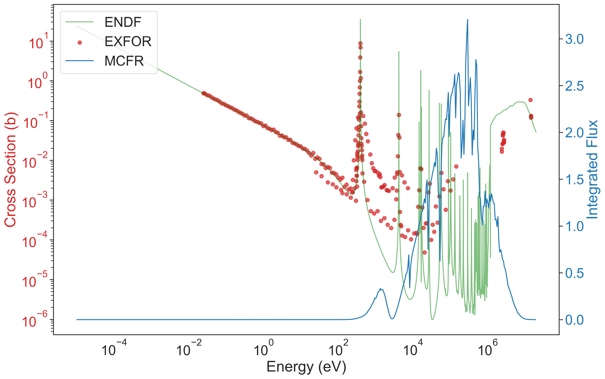

# Molten Chloride Fast Reactor (MCFR)

This directory contains the SERPENT input for the MCFR unit cell along with a notebook which explores the lack of chlorine data in the relevant operating energy region.

